# System Architecture Analysis

## Overview

- **Project**: /home/tom/github/wronai/toonic
- **Analysis Mode**: static
- **Total Functions**: 646
- **Total Classes**: 122
- **Modules**: 108
- **Entry Points**: 512

## Architecture by Module

### toonic.server.client
- **Functions**: 30
- **Classes**: 1
- **File**: `client.py`

### toonic.formats.document
- **Functions**: 22
- **Classes**: 5
- **File**: `document.py`

### examples.security-audit.enterprise_features
- **Functions**: 22
- **Classes**: 7
- **File**: `enterprise_features.py`

### toonic.server.main
- **Functions**: 21
- **Classes**: 1
- **File**: `main.py`

### toonic.formats.data
- **Functions**: 18
- **Classes**: 5
- **File**: `data.py`

### toonic.formats.evidence
- **Functions**: 17
- **Classes**: 4
- **File**: `evidence.py`

### toonic.formats.video
- **Functions**: 17
- **Classes**: 6
- **File**: `video.py`

### toonic.server.watchers.http_watcher
- **Functions**: 17
- **Classes**: 1
- **File**: `http_watcher.py`

### toonic.server.triggers.detectors
- **Functions**: 17
- **Classes**: 9
- **File**: `detectors.py`

### toonic.server.watchers.process_watcher
- **Functions**: 16
- **Classes**: 1
- **File**: `process_watcher.py`

### examples.security-audit.continuous_monitoring
- **Functions**: 16
- **Classes**: 1
- **File**: `continuous_monitoring.py`

### toonic.cli
- **Functions**: 15
- **File**: `cli.py`

### toonic.formats.audio
- **Functions**: 14
- **Classes**: 6
- **File**: `audio.py`

### toonic.server.core.history
- **Functions**: 14
- **Classes**: 2
- **File**: `history.py`

### toonic.server.triggers.scheduler
- **Functions**: 14
- **Classes**: 3
- **File**: `scheduler.py`

### toonic.formats.config
- **Functions**: 13
- **Classes**: 4
- **File**: `config.py`

### toonic.server.watchers.network_watcher
- **Functions**: 13
- **Classes**: 1
- **File**: `network_watcher.py`

### toonic.server.triggers.nlp2yaml
- **Functions**: 13
- **Classes**: 1
- **File**: `nlp2yaml.py`

### examples.run_all
- **Functions**: 12
- **File**: `run_all.py`

### toonic.server.watchers.docker_watcher
- **Functions**: 12
- **Classes**: 1
- **File**: `docker_watcher.py`

## Key Entry Points

Main execution flows into the system:

### toonic.server.watchers.directory_watcher.DirectoryWatcher._check_changes
> Compare current state with snapshot, detect changes.
- **Calls**: set, set, set, set, list, bool, self._take_snapshot, self._snapshot.keys

### toonic.autopilot.loop.AutopilotLoop.run
> Run the full autopilot loop. Returns action log.
- **Calls**: logger.info, LLMCaller, ResponseParser, range, self._emit, logger.info, self._emit, self._emit

### toonic.server.watchers.stream.watcher.StreamWatcher.__init__
- **Calls**: None.__init__, float, float, float, toonic.server.watchers.stream.watcher._bool, str, float, str

### toonic.server.watchers.database_watcher.DatabaseWatcher._check_sqlite
> Check SQLite database.
- **Calls**: Path, asyncio.get_event_loop, result.update, db_path.exists, db_path.stat, sqlite3.connect, loop.run_in_executor, str

### examples.security-audit.quick_audit.demo
> Demo: build configs without starting server (safe to run).
- **Calls**: print, print, print, print, examples.security-audit.quick_audit.audit_code, builder.build_config, print, print

### examples.programmatic-api.demo_accumulator.main
- **Calls**: print, print, print, ContextAccumulator, print, print, print, acc.get_chunks

### toonic.formats.audio.AudioFileHandler.parse
- **Calls**: AudioLogic, AudioLogic, np.frombuffer, samples.tobytes, SpeechDetector, detector.detect_speech_segments, wave.open, wav.getframerate

### toonic.server.watchers.process_watcher.ProcessWatcher._find_processes
> Find processes matching name using /proc or ps.
- **Calls**: os.path.isdir, os.listdir, asyncio.create_subprocess_exec, proc.communicate, None.splitlines, entry.isdigit, os.path.join, name.lower

### toonic.autopilot.executor.ActionExecutor._execute_code_change
> Extract file changes from LLM response and apply them.
- **Calls**: action.get, action.get, action.get, ExecutionResult, action.get, isinstance, self._extract_code, isinstance

### examples.run_all.main
- **Calls**: argparse.ArgumentParser, parser.add_argument, parser.add_argument, parser.add_argument, parser.add_argument, parser.add_argument, parser.add_argument, parser.add_argument

### toonic.server.watchers.network_watcher.NetworkWatcher._to_toon
> Convert results to TOON format.
- **Calls**: summary.get, summary.get, summary.get, summary.get, summary.get, sorted, None.join, None.join

### toonic.server.watchers.directory_watcher.DirectoryWatcher._build_diff_toon
> Build diff TOON representation.
- **Calls**: parts.append, None.join, len, parts.append, parts.append, parts.append, parts.append, len

### examples.security-audit.enterprise_features.EnterpriseSecurityMonitor.run_enterprise_analysis
> Run comprehensive enterprise security analysis.
- **Calls**: logger.info, logger.info, self.collect_metrics, self.analyze_security_headers, self.analyze_ssl_configuration, self.anomaly_detector.collect_baseline, self.anomaly_detector.detect_anomalies, self.threat_manager.check_indicators

### toonic.autopilot.scaffold.ProjectScaffold.generate
> Generate all project files into output_dir. Returns {path: content}.
- **Calls**: Path, project_dir.mkdir, LANGUAGE_GENERATORS.get, generator, all_files.update, None.lower, None.join, None.join

### toonic.server.llm.parser.ResponseParser.parse
- **Calls**: raw.get, raw.get, ActionResponse, ActionResponse, content.strip, clean.startswith, clean.find, clean.rfind

### toonic.formats.evidence.EvidenceGraphHandler._to_toon
- **Calls**: sum, categories.items, None.join, None.append, lines.append, lines.append, lines.append, lines.append

### toonic.server.watchers.file_watcher.FileWatcher._full_scan
> Initial scan — generate full TOON spec for all files.
- **Calls**: Path, path.is_file, sorted, path.exists, logger.warning, path.rglob, self._should_skip, None.join

### toonic.server.watchers.database_watcher.DatabaseWatcher._to_toon
> Convert check result to TOON format.
- **Calls**: result.get, result.get, result.get, result.get, result.get, result.get, result.get, result.get

### toonic.server.watchers.network_watcher.NetworkWatcher._detect_changes
> Detect changes from previous results.
- **Calls**: current.items, self._prev_results.get, prev.get, result.get, prev.get, result.get, prev.get, result.get

### toonic.formats.data.CsvHandler.parse
- **Calls**: path.read_text, self._compute_hash, csv.reader, list, enumerate, TableLogic, None.sniff, io.StringIO

### toonic.formats.video.VideoFileHandler.parse
- **Calls**: cv2.VideoCapture, int, int, int, cap.release, SceneDetector, detector.detect_from_file, range

### toonic.server.client._print_status
> Print server status.
- **Calls**: client.get_status, print, print, print, print, print, print, data.get

### toonic.server.transport.routes.api.get_events_file
> Read persisted events.jsonl with basic pagination.
- **Calls**: router.get, toonic.server.transport.routes.sources._get_server, Path, getattr, path.exists, all_lines.reverse, enumerate, str

### examples.security-audit.continuous_monitoring.main
> Main function.
- **Calls**: argparse.ArgumentParser, parser.add_argument, parser.add_argument, parser.add_argument, parser.parse_args, SecurityMonitor, monitor.start_daemon, print

### toonic.formats.database.SqlHandler._extract_columns
- **Calls**: current.append, parts.append, part.strip, re.match, part.split, None.strip, None.upper, columns.append

### toonic.server.watchers.http_watcher.HttpWatcher._to_toon
> Convert check result to TOON format.
- **Calls**: result.get, result.get, result.get, result.get, result.get, result.get, result.get, result.get

### toonic.server.watchers.log_watcher.LogWatcher._to_toon
> Convert log lines to TOON format.
- **Calls**: parts.append, None.join, len, parts.append, parts.append, parts.append, any, len

### toonic.server.watchers.network_watcher.NetworkWatcher.__init__
- **Calls**: None.__init__, target.startswith, float, float, int, options.get, options.get, target.startswith

### toonic.server.watchers.docker_watcher.DockerWatcher._to_toon
> Convert check result to TOON format.
- **Calls**: result.get, result.get, result.get, result.get, result.get, sorted, None.join, None.join

### toonic.server.watchers.directory_watcher.DirectoryWatcher._build_tree_toon
> Build initial tree TOON representation.
- **Calls**: sum, sum, parts.append, parts.extend, None.join, len, sorted, len

## Process Flows

Key execution flows identified:

### Flow 1: _check_changes
```
_check_changes [toonic.server.watchers.directory_watcher.DirectoryWatcher]
```

### Flow 2: run
```
run [toonic.autopilot.loop.AutopilotLoop]
```

### Flow 3: __init__
```
__init__ [toonic.server.watchers.stream.watcher.StreamWatcher]
  └─ →> _bool
```

### Flow 4: _check_sqlite
```
_check_sqlite [toonic.server.watchers.database_watcher.DatabaseWatcher]
```

### Flow 5: demo
```
demo [examples.security-audit.quick_audit]
  └─> audit_code
      └─ →> security_audit
          └─> _apply_overrides
          └─ →> watch
```

### Flow 6: main
```
main [examples.programmatic-api.demo_accumulator]
```

### Flow 7: parse
```
parse [toonic.formats.audio.AudioFileHandler]
```

### Flow 8: _find_processes
```
_find_processes [toonic.server.watchers.process_watcher.ProcessWatcher]
```

### Flow 9: _execute_code_change
```
_execute_code_change [toonic.autopilot.executor.ActionExecutor]
```

### Flow 10: _to_toon
```
_to_toon [toonic.server.watchers.network_watcher.NetworkWatcher]
```

## Key Classes

### toonic.server.main.ToonicServer
> Main server — connects watchers → accumulator → LLM router → actions.
- **Methods**: 21
- **Key Methods**: toonic.server.main.ToonicServer.__init__, toonic.server.main.ToonicServer.start, toonic.server.main.ToonicServer.stop, toonic.server.main.ToonicServer.add_source, toonic.server.main.ToonicServer.remove_source, toonic.server.main.ToonicServer._consume_watcher, toonic.server.main.ToonicServer._on_trigger_fired, toonic.server.main.ToonicServer._analysis_loop, toonic.server.main.ToonicServer._one_shot, toonic.server.main.ToonicServer._run_analysis

### toonic.server.watchers.http_watcher.HttpWatcher
> Watches HTTP/HTTPS endpoints for availability, content changes, and performance.
- **Methods**: 17
- **Key Methods**: toonic.server.watchers.http_watcher.HttpWatcher.__init__, toonic.server.watchers.http_watcher.HttpWatcher.start, toonic.server.watchers.http_watcher.HttpWatcher.stop, toonic.server.watchers.http_watcher.HttpWatcher._poll_loop, toonic.server.watchers.http_watcher.HttpWatcher._check_endpoint, toonic.server.watchers.http_watcher.HttpWatcher._update_result_with_fetch, toonic.server.watchers.http_watcher.HttpWatcher._detect_changes, toonic.server.watchers.http_watcher.HttpWatcher._check_keywords, toonic.server.watchers.http_watcher.HttpWatcher._check_ssl_and_update, toonic.server.watchers.http_watcher.HttpWatcher._update_state
- **Inherits**: BaseWatcher

### toonic.server.watchers.process_watcher.ProcessWatcher
> Watches system processes, ports, and service health.
- **Methods**: 16
- **Key Methods**: toonic.server.watchers.process_watcher.ProcessWatcher.__init__, toonic.server.watchers.process_watcher.ProcessWatcher._parse_target, toonic.server.watchers.process_watcher.ProcessWatcher.start, toonic.server.watchers.process_watcher.ProcessWatcher.stop, toonic.server.watchers.process_watcher.ProcessWatcher._poll_loop, toonic.server.watchers.process_watcher.ProcessWatcher._check, toonic.server.watchers.process_watcher.ProcessWatcher._check_process_name, toonic.server.watchers.process_watcher.ProcessWatcher._check_pid, toonic.server.watchers.process_watcher.ProcessWatcher._check_port, toonic.server.watchers.process_watcher.ProcessWatcher._check_service
- **Inherits**: BaseWatcher

### examples.security-audit.continuous_monitoring.SecurityMonitor
> Continuous security monitoring system.
- **Methods**: 15
- **Key Methods**: examples.security-audit.continuous_monitoring.SecurityMonitor.__init__, examples.security-audit.continuous_monitoring.SecurityMonitor.load_config, examples.security-audit.continuous_monitoring.SecurityMonitor.check_ssl_certificate, examples.security-audit.continuous_monitoring.SecurityMonitor.check_security_headers, examples.security-audit.continuous_monitoring.SecurityMonitor.check_response_time, examples.security-audit.continuous_monitoring.SecurityMonitor.check_content_changes, examples.security-audit.continuous_monitoring.SecurityMonitor.check_dependencies, examples.security-audit.continuous_monitoring.SecurityMonitor.run_all_checks, examples.security-audit.continuous_monitoring.SecurityMonitor.calculate_security_score, examples.security-audit.continuous_monitoring.SecurityMonitor.send_alert

### toonic.server.client.ToonicClient
> REST + WebSocket client for Toonic Server.
- **Methods**: 13
- **Key Methods**: toonic.server.client.ToonicClient.__init__, toonic.server.client.ToonicClient.get_status, toonic.server.client.ToonicClient.get_actions, toonic.server.client.ToonicClient.get_formats, toonic.server.client.ToonicClient.analyze, toonic.server.client.ToonicClient.add_source, toonic.server.client.ToonicClient.convert, toonic.server.client.ToonicClient.get_history, toonic.server.client.ToonicClient.get_history_stats, toonic.server.client.ToonicClient.nlp_query

### toonic.server.watchers.network_watcher.NetworkWatcher
> Watches network endpoints for connectivity, latency, and DNS resolution.
- **Methods**: 13
- **Key Methods**: toonic.server.watchers.network_watcher.NetworkWatcher.__init__, toonic.server.watchers.network_watcher.NetworkWatcher.start, toonic.server.watchers.network_watcher.NetworkWatcher.stop, toonic.server.watchers.network_watcher.NetworkWatcher._poll_loop, toonic.server.watchers.network_watcher.NetworkWatcher._check, toonic.server.watchers.network_watcher.NetworkWatcher._check_target, toonic.server.watchers.network_watcher.NetworkWatcher._resolve_dns, toonic.server.watchers.network_watcher.NetworkWatcher._ping, toonic.server.watchers.network_watcher.NetworkWatcher._tcp_ping, toonic.server.watchers.network_watcher.NetworkWatcher._check_ports
- **Inherits**: BaseWatcher

### toonic.server.triggers.nlp2yaml.NLP2YAML
> Converts natural language to YAML trigger configuration via LLM.
- **Methods**: 13
- **Key Methods**: toonic.server.triggers.nlp2yaml.NLP2YAML.__init__, toonic.server.triggers.nlp2yaml.NLP2YAML.generate, toonic.server.triggers.nlp2yaml.NLP2YAML.generate_yaml, toonic.server.triggers.nlp2yaml.NLP2YAML._try_local_parse, toonic.server.triggers.nlp2yaml.NLP2YAML._parse_object_condition, toonic.server.triggers.nlp2yaml.NLP2YAML._parse_motion_condition, toonic.server.triggers.nlp2yaml.NLP2YAML._parse_scene_change_condition, toonic.server.triggers.nlp2yaml.NLP2YAML._parse_pattern_condition, toonic.server.triggers.nlp2yaml.NLP2YAML._parse_audio_conditions, toonic.server.triggers.nlp2yaml.NLP2YAML._build_trigger_rule

### toonic.server.core.history.ConversationHistory
> SQLite-backed conversation history for all LLM exchanges.
- **Methods**: 12
- **Key Methods**: toonic.server.core.history.ConversationHistory.__init__, toonic.server.core.history.ConversationHistory._init_db, toonic.server.core.history.ConversationHistory._conn, toonic.server.core.history.ConversationHistory.record, toonic.server.core.history.ConversationHistory.get, toonic.server.core.history.ConversationHistory.recent, toonic.server.core.history.ConversationHistory.search, toonic.server.core.history.ConversationHistory.execute_sql, toonic.server.core.history.ConversationHistory.stats, toonic.server.core.history.ConversationHistory.clear

### toonic.server.watchers.docker_watcher.DockerWatcher
> Watches Docker containers for status changes, resource usage, and health.
- **Methods**: 12
- **Key Methods**: toonic.server.watchers.docker_watcher.DockerWatcher.__init__, toonic.server.watchers.docker_watcher.DockerWatcher.start, toonic.server.watchers.docker_watcher.DockerWatcher.stop, toonic.server.watchers.docker_watcher.DockerWatcher._check_docker, toonic.server.watchers.docker_watcher.DockerWatcher._poll_loop, toonic.server.watchers.docker_watcher.DockerWatcher._check, toonic.server.watchers.docker_watcher.DockerWatcher._list_containers, toonic.server.watchers.docker_watcher.DockerWatcher._fetch_stats, toonic.server.watchers.docker_watcher.DockerWatcher._fetch_logs, toonic.server.watchers.docker_watcher.DockerWatcher._detect_changes
- **Inherits**: BaseWatcher

### toonic.server.watchers.directory_watcher.DirectoryWatcher
> Watches directory trees for structural changes (new/deleted/moved files).
- **Methods**: 12
- **Key Methods**: toonic.server.watchers.directory_watcher.DirectoryWatcher.__init__, toonic.server.watchers.directory_watcher.DirectoryWatcher.start, toonic.server.watchers.directory_watcher.DirectoryWatcher.stop, toonic.server.watchers.directory_watcher.DirectoryWatcher._initial_scan, toonic.server.watchers.directory_watcher.DirectoryWatcher._poll_loop, toonic.server.watchers.directory_watcher.DirectoryWatcher._check_changes, toonic.server.watchers.directory_watcher.DirectoryWatcher._take_snapshot, toonic.server.watchers.directory_watcher.DirectoryWatcher._walk, toonic.server.watchers.directory_watcher.DirectoryWatcher._build_tree_toon, toonic.server.watchers.directory_watcher.DirectoryWatcher._build_diff_toon
- **Inherits**: BaseWatcher

### toonic.formats.document.MarkdownHandler
> Handler dla plików Markdown (.md, .markdown).
- **Methods**: 11
- **Key Methods**: toonic.formats.document.MarkdownHandler.parse, toonic.formats.document.MarkdownHandler._extract_sections, toonic.formats.document.MarkdownHandler._summarize, toonic.formats.document.MarkdownHandler.to_spec, toonic.formats.document.MarkdownHandler._to_toon, toonic.formats.document.MarkdownHandler._to_yaml, toonic.formats.document.MarkdownHandler.reproduce, toonic.formats.document.MarkdownHandler._reproduce_template, toonic.formats.document.MarkdownHandler._chunk_by_sections, toonic.formats.document.MarkdownHandler._get_chunk_prompt
- **Inherits**: BaseHandlerMixin

### toonic.server.watchers.database_watcher.DatabaseWatcher
> Watches databases for schema changes, row count changes, and query result diffs.
- **Methods**: 11
- **Key Methods**: toonic.server.watchers.database_watcher.DatabaseWatcher.__init__, toonic.server.watchers.database_watcher.DatabaseWatcher._detect_db_type, toonic.server.watchers.database_watcher.DatabaseWatcher.start, toonic.server.watchers.database_watcher.DatabaseWatcher.stop, toonic.server.watchers.database_watcher.DatabaseWatcher._poll_loop, toonic.server.watchers.database_watcher.DatabaseWatcher._check, toonic.server.watchers.database_watcher.DatabaseWatcher._check_sqlite, toonic.server.watchers.database_watcher.DatabaseWatcher._check_postgresql, toonic.server.watchers.database_watcher.DatabaseWatcher._detect_changes, toonic.server.watchers.database_watcher.DatabaseWatcher._to_toon
- **Inherits**: BaseWatcher

### toonic.autopilot.loop.AutopilotLoop
> Main autonomous development loop.
- **Methods**: 10
- **Key Methods**: toonic.autopilot.loop.AutopilotLoop.__init__, toonic.autopilot.loop.AutopilotLoop.run, toonic.autopilot.loop.AutopilotLoop.stop, toonic.autopilot.loop.AutopilotLoop._fix_loop, toonic.autopilot.loop.AutopilotLoop._scan_project, toonic.autopilot.loop.AutopilotLoop._read_roadmap, toonic.autopilot.loop.AutopilotLoop._update_roadmap, toonic.autopilot.loop.AutopilotLoop._is_roadmap_complete, toonic.autopilot.loop.AutopilotLoop._format_previous_actions, toonic.autopilot.loop.AutopilotLoop._emit

### toonic.autopilot.executor.ActionExecutor
> Executes LLM-generated actions on the project filesystem.
- **Methods**: 10
- **Key Methods**: toonic.autopilot.executor.ActionExecutor.__init__, toonic.autopilot.executor.ActionExecutor.execute, toonic.autopilot.executor.ActionExecutor._execute_code_change, toonic.autopilot.executor.ActionExecutor._execute_delete, toonic.autopilot.executor.ActionExecutor._execute_tests, toonic.autopilot.executor.ActionExecutor._resolve_path, toonic.autopilot.executor.ActionExecutor._write_file, toonic.autopilot.executor.ActionExecutor._extract_code, toonic.autopilot.executor.ActionExecutor._extract_file_blocks, toonic.autopilot.executor.ActionExecutor.get_history

### toonic.server.watchers.file_watcher.FileWatcher
> Watches a directory for file changes, converts to TOON specs.
- **Methods**: 10
- **Key Methods**: toonic.server.watchers.file_watcher.FileWatcher.__init__, toonic.server.watchers.file_watcher.FileWatcher.start, toonic.server.watchers.file_watcher.FileWatcher.stop, toonic.server.watchers.file_watcher.FileWatcher._full_scan, toonic.server.watchers.file_watcher.FileWatcher._poll_loop, toonic.server.watchers.file_watcher.FileWatcher._check_changes, toonic.server.watchers.file_watcher.FileWatcher._convert_file, toonic.server.watchers.file_watcher.FileWatcher._detect_category, toonic.server.watchers.file_watcher.FileWatcher._should_skip, toonic.server.watchers.file_watcher.FileWatcher.supports
- **Inherits**: BaseWatcher

### examples.security-audit.enterprise_features.EnterpriseSecurityMonitor
> Enterprise-grade security monitoring system.
- **Methods**: 10
- **Key Methods**: examples.security-audit.enterprise_features.EnterpriseSecurityMonitor.__init__, examples.security-audit.enterprise_features.EnterpriseSecurityMonitor.load_config, examples.security-audit.enterprise_features.EnterpriseSecurityMonitor.collect_metrics, examples.security-audit.enterprise_features.EnterpriseSecurityMonitor.analyze_security_headers, examples.security-audit.enterprise_features.EnterpriseSecurityMonitor.analyze_ssl_configuration, examples.security-audit.enterprise_features.EnterpriseSecurityMonitor.run_enterprise_analysis, examples.security-audit.enterprise_features.EnterpriseSecurityMonitor._calculate_compliance_score, examples.security-audit.enterprise_features.EnterpriseSecurityMonitor._calculate_security_score, examples.security-audit.enterprise_features.EnterpriseSecurityMonitor._save_results, examples.security-audit.enterprise_features.EnterpriseSecurityMonitor._generate_markdown_report

### toonic.formats.evidence.EvidenceGraphBuilder
> Buduje Evidence Graph z wielu źródeł.
- **Methods**: 9
- **Key Methods**: toonic.formats.evidence.EvidenceGraphBuilder.__init__, toonic.formats.evidence.EvidenceGraphBuilder.add_code_evidence, toonic.formats.evidence.EvidenceGraphBuilder.add_document_evidence, toonic.formats.evidence.EvidenceGraphBuilder.add_video_evidence, toonic.formats.evidence.EvidenceGraphBuilder.add_audio_evidence, toonic.formats.evidence.EvidenceGraphBuilder.add_database_evidence, toonic.formats.evidence.EvidenceGraphBuilder.add_test_evidence, toonic.formats.evidence.EvidenceGraphBuilder.build, toonic.formats.evidence.EvidenceGraphBuilder._auto_link_relations

### toonic.server.triggers.scheduler.TriggerScheduler
> Manages all trigger rules and evaluates incoming data against them.
- **Methods**: 9
- **Key Methods**: toonic.server.triggers.scheduler.TriggerScheduler.__init__, toonic.server.triggers.scheduler.TriggerScheduler.on_trigger, toonic.server.triggers.scheduler.TriggerScheduler.evaluate, toonic.server.triggers.scheduler.TriggerScheduler.evaluate_async, toonic.server.triggers.scheduler.TriggerScheduler.add_rule, toonic.server.triggers.scheduler.TriggerScheduler.remove_rule, toonic.server.triggers.scheduler.TriggerScheduler.get_stats, toonic.server.triggers.scheduler.TriggerScheduler.from_yaml, toonic.server.triggers.scheduler.TriggerScheduler.default_periodic

### toonic.server.core.accumulator.ContextAccumulator
> Manages context window for LLM — allocates token budget per category.

REFACTORED: priority-based ev
- **Methods**: 8
- **Key Methods**: toonic.server.core.accumulator.ContextAccumulator.__init__, toonic.server.core.accumulator.ContextAccumulator.update, toonic.server.core.accumulator.ContextAccumulator.get_context, toonic.server.core.accumulator.ContextAccumulator.get_chunks, toonic.server.core.accumulator.ContextAccumulator._build_context, toonic.server.core.accumulator.ContextAccumulator._enforce_budget, toonic.server.core.accumulator.ContextAccumulator.get_stats, toonic.server.core.accumulator.ContextAccumulator.clear

### toonic.server.watchers.log_watcher.LogWatcher
> Tails log files and emits TOON-compressed log context.
- **Methods**: 8
- **Key Methods**: toonic.server.watchers.log_watcher.LogWatcher.__init__, toonic.server.watchers.log_watcher.LogWatcher.start, toonic.server.watchers.log_watcher.LogWatcher.stop, toonic.server.watchers.log_watcher.LogWatcher._initial_tail, toonic.server.watchers.log_watcher.LogWatcher._tail_loop, toonic.server.watchers.log_watcher.LogWatcher._check_new_lines, toonic.server.watchers.log_watcher.LogWatcher._to_toon, toonic.server.watchers.log_watcher.LogWatcher.supports
- **Inherits**: BaseWatcher

## Data Transformation Functions

Key functions that process and transform data:

### toonic.cli._cmd_formats
> Handle 'formats' command - list supported formats.
- **Output to**: toonic.pipeline.Pipeline.formats, print, None.items, print, print

### toonic.cli._build_argument_parser
> Build and return the argument parser.
- **Output to**: argparse.ArgumentParser, parser.add_subparsers, subparsers.add_parser, spec_parser.add_argument, spec_parser.add_argument

### toonic.core.base.BaseHandlerMixin._format_toon_header
> Generuje nagłówek TOON: # filename | type | metryki.
- **Output to**: kwargs.items, None.join, parts.append, isinstance, str

### toonic.core.detector.SpecDetector.detect_spec_format
> Wykryj format spec: toon, yaml, json.
- **Output to**: content.strip, stripped.startswith, stripped.startswith

### toonic.core.protocols.FileHandler.parse
> Kierunek A: plik źródłowy → logika.

### toonic.pipeline.Pipeline.formats
> Lista dostępnych formatów i ich status.
- **Output to**: toonic.pipeline.Pipeline._ensure_initialized, toonic.core.registry.FormatRegistry.list_categories, toonic.core.registry.FormatRegistry.available, len

### toonic.formats.document.MarkdownHandler.parse
> Parsuje Markdown → DocumentLogic.
- **Output to**: path.read_text, self._compute_hash, content.startswith, self._extract_sections, frontmatter.get

### toonic.formats.document.TextHandler.parse
- **Output to**: path.read_text, enumerate, DocumentLogic, p.strip, sections.append

### toonic.formats.document.RstHandler.parse
- **Output to**: path.read_text, content.split, enumerate, DocumentLogic, all

### toonic.formats.audio.AudioFileHandler.parse
- **Output to**: AudioLogic, AudioLogic, np.frombuffer, samples.tobytes, SpeechDetector

### toonic.formats.config.DockerfileHandler.parse
- **Output to**: path.read_text, self._compute_hash, content.split, ConfigLogic, line.strip

### toonic.formats.config.EnvHandler.parse
- **Output to**: path.read_text, self._compute_hash, content.split, ConfigLogic, line.strip

### toonic.formats.api.OpenApiHandler.parse
- **Output to**: path.read_text, self._compute_hash, re.search, re.search, content.split

### toonic.formats.evidence.EvidenceGraphHandler.parse
- **Output to**: path.read_text, EvidenceGraph, self._compute_hash

### toonic.formats.video.VideoFileHandler.parse
- **Output to**: cv2.VideoCapture, int, int, int, cap.release

### toonic.formats.database.SqlHandler.parse
- **Output to**: path.read_text, self._compute_hash, self._extract_tables, re.findall, re.findall

### toonic.formats.infra.KubernetesHandler.parse
- **Output to**: path.read_text, self._compute_hash, content.split, InfraLogic, re.search

### toonic.formats.infra.GithubActionsHandler.parse
- **Output to**: path.read_text, self._compute_hash, content.split, re.search, InfraLogic

### toonic.formats.data.CsvHandler.parse
- **Output to**: path.read_text, self._compute_hash, csv.reader, list, enumerate

### toonic.formats.data.JsonDataHandler.parse
- **Output to**: path.read_text, self._compute_hash, isinstance, self._compute_depth, self._count_keys

### toonic.server.client.ToonicClient.get_formats
- **Output to**: self._get

### toonic.server.client.ToonicClient.convert
- **Output to**: self._post

### toonic.server.client._print_formats
> Print supported formats.
- **Output to**: client.get_formats, None.items, print, print, data.get

### toonic.server.client._cmd_convert
> Execute convert command. Returns True if executed.
- **Output to**: client.convert, len, print, print, print

### toonic.autopilot.loop.AutopilotLoop._format_previous_actions
> Format recent actions for context.
- **Output to**: None.join, lines.append, a.get, a.get, lines.append

## Behavioral Patterns

### state_machine_RuleState
- **Type**: state_machine
- **Confidence**: 0.70
- **Functions**: toonic.server.triggers.scheduler.RuleState.__init__, toonic.server.triggers.scheduler.RuleState.evaluate, toonic.server.triggers.scheduler.RuleState.get_stats

### state_machine_AnomalyDetector
- **Type**: state_machine
- **Confidence**: 0.70
- **Functions**: examples.security-audit.enterprise_features.AnomalyDetector.__init__, examples.security-audit.enterprise_features.AnomalyDetector.collect_baseline, examples.security-audit.enterprise_features.AnomalyDetector.detect_anomalies

### state_machine_ThreatIntelligenceManager
- **Type**: state_machine
- **Confidence**: 0.70
- **Functions**: examples.security-audit.enterprise_features.ThreatIntelligenceManager.__init__, examples.security-audit.enterprise_features.ThreatIntelligenceManager.fetch_threat_intelligence, examples.security-audit.enterprise_features.ThreatIntelligenceManager._fetch_feed, examples.security-audit.enterprise_features.ThreatIntelligenceManager.check_indicators

### state_machine_ComplianceManager
- **Type**: state_machine
- **Confidence**: 0.70
- **Functions**: examples.security-audit.enterprise_features.ComplianceManager.__init__, examples.security-audit.enterprise_features.ComplianceManager.check_gdpr_compliance, examples.security-audit.enterprise_features.ComplianceManager.check_iso27001_compliance, examples.security-audit.enterprise_features.ComplianceManager.generate_compliance_report

### state_machine_EnterpriseSecurityMonitor
- **Type**: state_machine
- **Confidence**: 0.70
- **Functions**: examples.security-audit.enterprise_features.EnterpriseSecurityMonitor.__init__, examples.security-audit.enterprise_features.EnterpriseSecurityMonitor.load_config, examples.security-audit.enterprise_features.EnterpriseSecurityMonitor.collect_metrics, examples.security-audit.enterprise_features.EnterpriseSecurityMonitor.analyze_security_headers, examples.security-audit.enterprise_features.EnterpriseSecurityMonitor.analyze_ssl_configuration

## Public API Surface

Functions exposed as public API (no underscore prefix):

- `toonic.server.transport.broxeen_bridge.register_broxeen_routes` - 105 calls
- `toonic.autopilot.loop.AutopilotLoop.run` - 47 calls
- `toonic.server.watchers.stream.events.check_event_and_emit` - 39 calls
- `examples.security-audit.quick_audit.demo` - 37 calls
- `examples.programmatic-api.demo_accumulator.main` - 36 calls
- `toonic.formats.audio.AudioFileHandler.parse` - 34 calls
- `examples.programmatic-api.demo_quick.demo_config_builder` - 34 calls
- `unified_toon.create_unified_toon` - 31 calls
- `examples.run_all.main` - 31 calls
- `toonic.server.watchers.stream.capture.capture_opencv` - 31 calls
- `examples.security-audit.enterprise_features.EnterpriseSecurityMonitor.run_enterprise_analysis` - 30 calls
- `toonic.autopilot.scaffold.ProjectScaffold.generate` - 29 calls
- `toonic.server.llm.parser.ResponseParser.parse` - 28 calls
- `toonic.formats.data.CsvHandler.parse` - 25 calls
- `examples.run_all.execute_all` - 24 calls
- `toonic.formats.video.VideoFileHandler.parse` - 24 calls
- `examples.run_all.verify_all` - 23 calls
- `toonic.pipeline.Pipeline.reproduce` - 23 calls
- `toonic.server.transport.routes.api.get_events_file` - 23 calls
- `examples.security-audit.continuous_monitoring.main` - 23 calls
- `toonic.server.transport.app.create_app` - 22 calls
- `toonic.server.transport.routes.api.get_exchanges` - 20 calls
- `examples.security-audit.generate_report.generate_markdown_report` - 20 calls
- `toonic.formats.infra.KubernetesHandler.parse` - 19 calls
- `toonic.server.client.main` - 19 calls
- `toonic.autopilot.executor.ActionExecutor.execute` - 19 calls
- `examples.security-audit.generate_report.main` - 19 calls
- `examples.security-audit.enterprise_features.AnomalyDetector.detect_anomalies` - 19 calls
- `toonic.pipeline.Pipeline.batch` - 18 calls
- `toonic.formats.document.MarkdownHandler.parse` - 18 calls
- `toonic.formats.data.JsonDataHandler.parse` - 18 calls
- `examples.log-monitoring.generate_logs.run_error_spike` - 18 calls
- `toonic.server.llm.caller.LLMCaller.call` - 18 calls
- `examples.run_all.list_examples` - 17 calls
- `toonic.formats.api.OpenApiHandler.parse` - 17 calls
- `toonic.server.core.history.ConversationHistory.recent` - 17 calls
- `toonic.autopilot.scaffold.ProjectScaffold.detect_spec` - 17 calls
- `toonic.server.triggers.dsl.TriggerRule.from_dict` - 17 calls
- `toonic.server.transport.routes.websocket.register` - 17 calls
- `toonic.formats.document.RstHandler.parse` - 16 calls

## System Interactions

How components interact:

```mermaid
graph TD
    _check_changes --> set
    _check_changes --> list
    run --> info
    run --> LLMCaller
    run --> ResponseParser
    run --> range
    run --> _emit
    __init__ --> __init__
    __init__ --> float
    __init__ --> _bool
    _check_sqlite --> Path
    _check_sqlite --> get_event_loop
    _check_sqlite --> update
    _check_sqlite --> exists
    _check_sqlite --> stat
    demo --> print
    demo --> audit_code
    main --> print
    main --> ContextAccumulator
    parse --> AudioLogic
    parse --> frombuffer
    parse --> tobytes
    parse --> SpeechDetector
    _find_processes --> isdir
    _find_processes --> listdir
    _find_processes --> create_subprocess_ex
    _find_processes --> communicate
    _find_processes --> splitlines
    _execute_code_change --> get
    _execute_code_change --> ExecutionResult
```



## Reverse Engineering Guidelines

1. **Entry Points**: Start analysis from the entry points listed above
2. **Core Logic**: Focus on classes with many methods
3. **Data Flow**: Follow data transformation functions
4. **Process Flows**: Use the flow diagrams for execution paths
5. **API Surface**: Public API functions reveal the interface

## Context for LLM

Maintain the identified architectural patterns and public API surface when suggesting changes.